##  Big Data Projects

I collected the final projects of the BIG DATA course taken in 2022:

- [Google Data Studio Project](#googledatastudio)
- [Python Data Analysis Project](#python)
- [SQL Data Analysis Project](#sql)

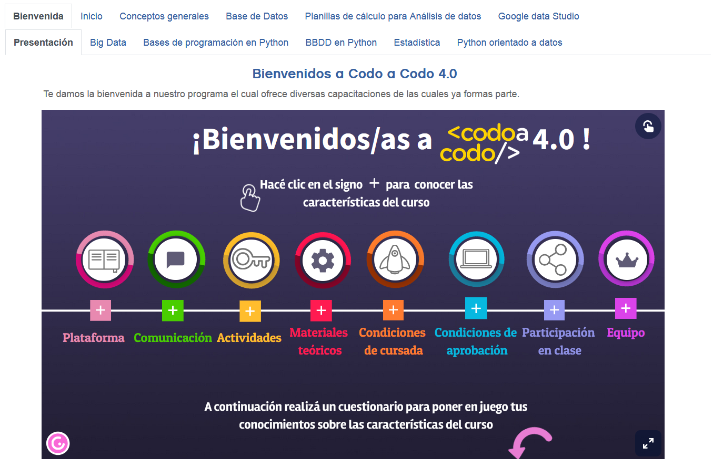

## Skills and resources  

 
 

 
 

# [Google Data Studio project](https://datastudio.google.com/s/uEVVnRH041U) 

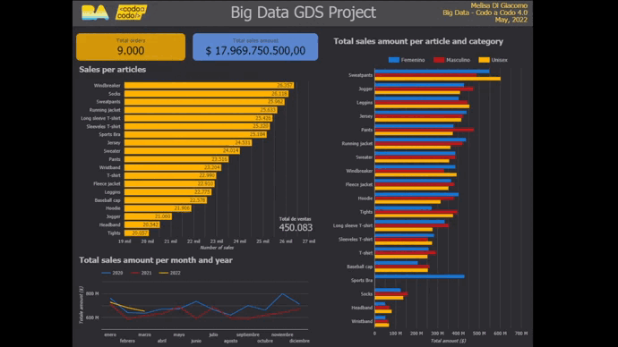

## LINK: [GDS project](https://datastudio.google.com/s/uEVVnRH041U)

In this project I had to obtain, debug and process a dataset that allows generating a dashboard in Google Data Studio that displays requested information.

Data sources:  
• Orders file: orders.csv  
• Google Sheets: bbdd_integrador.gsheet

The data requested by the customer was:  
• Total orders  
• Total sales amount  
• Sales per article  
• Total sales amount per article and category  
• Total sales amount per month and year  

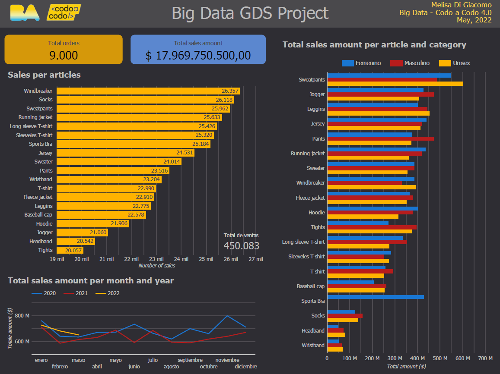

• Number of custmers  
• Number of countries  
• Top 5 customers and their total sales amounts  
• Top 5 countries and their total sales amounts  
• Top 5 customers with their countries and total amounts  
• Top 5 countries with their customers and total amounts

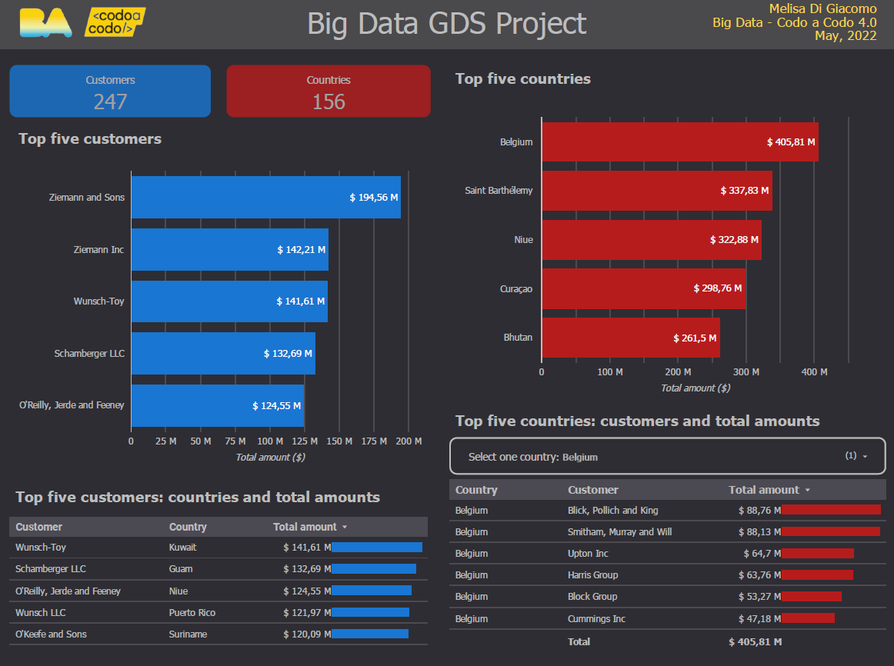

## Development

All request were answered with dynamic data visualizations that the customer can select, filter and get details while hover. A dark theme was selected to highlight visualizations with colors. Barplots were selected to displays measuments of different dimensions. They were plotted horizontally to facilitate labels reading. A line plot was selected to display time series information as a continuous. Dinamic tables with filters were used for more detailed information.

# [Python data analysis project](https://deepnote.com/@data-analysis-352e/Big-Data-Final-Project-Di-Giacomo-Melisa-97af6527-c629-4060-9781-4e1541ce282d) 

## LINK: [Python data analysis report](https://deepnote.com/@data-analysis-352e/Big-Data-Final-Project-Di-Giacomo-Melisa-97af6527-c629-4060-9781-4e1541ce282d) 

  

This project is a report for a customer.

I integrated three datasets with information about sellers, articles and orders of one-month trade log, which helped to answer some questions.

I used Pandas tools for exploratory analysis, SQLite3 to manage databases in Python and Matplotlib/Seaborn for data visualization.

Data sources:  
• articles.db: DB with articles data  
• sellers.xlsx: Excel file with sellers data  
• orders.csv: CSV file with sales records withing the month  

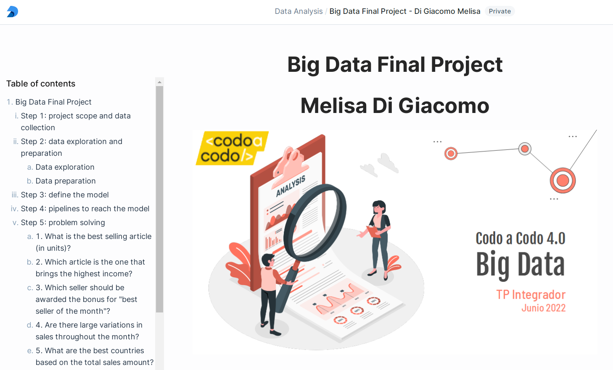  

## Table of contents  
### - Step 1: project scope and data collection  
### - Step 2: data exploration and preparation  
1. Data exploration  
2. Data preparation  
### - Step 3: define the model  
### - Step 4: pipelines to reach the model  
### - Step 5: problem solving  
1. What is the best selling article (in units)?  
2. Which article is the one that brings the highest income?  
3. Which seller should be awarded the bonus for "best seller of the month"?  
4. Are there large variations in sales throughout the month?  
5. What are the best countries based on the total sales amount?  
6. What is the correlation between countries and the top five articles?  
7. Which is the top article of each country?  
8. Finally, which is the best country and what are the total sales amounts of the top five articles?  
### - Conclusions    

## Development

First of all I had to be able to read datasets in python of different extensions and convert them into dataframes. I had to read CSV and Excel files and also a database. I used Pandas, SQLite3 and openpyxl libraries to do that.
I explored the data (number of columns and entries, presence of null values, data types, unique indexes) and prepared it. Finally, I integrated all data frames into one to work with.  
In the problem solving part I was asked four questions for which I had to build an analytical and graphical answer. At the end I had to ask four questions myself and answer them.  
In the final part I had to write conclusions and proposals.  

## Notebook with python codes

### LINK: [Deepnote notebook with Python codes](https://deepnote.com/workspace/data-analysis-352e-ba39934f-0d8a-43eb-90d5-dfcaac9dda1c/project/Big-Data-Final-Project-Di-Giacomo-Melisa-97af6527-c629-4060-9781-4e1541ce282d/%2FBigData_Project.ipynb) 

 

I built the notebook in deepnote. All codes were developed for reuse with new datasets from the same customer in subsequent months. Changing the three files at the begining and rerunning the notebook will create the report of next month.

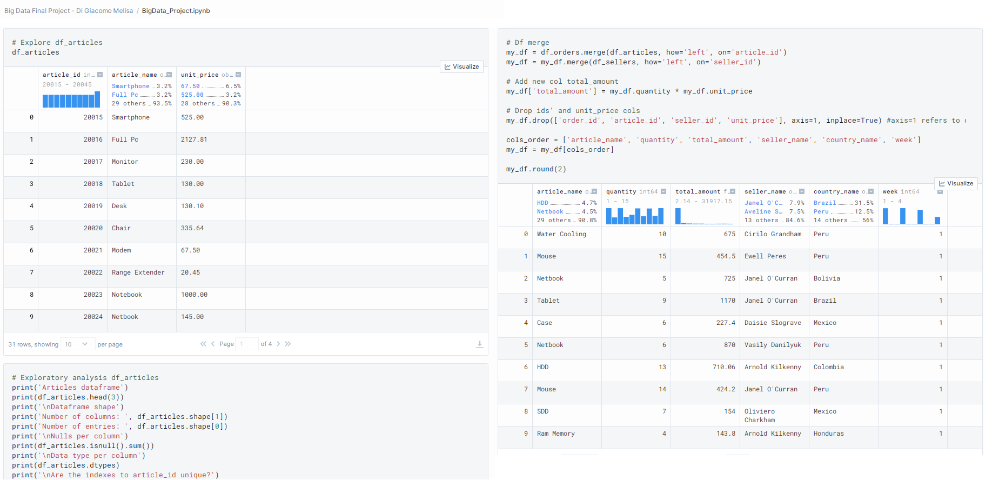   
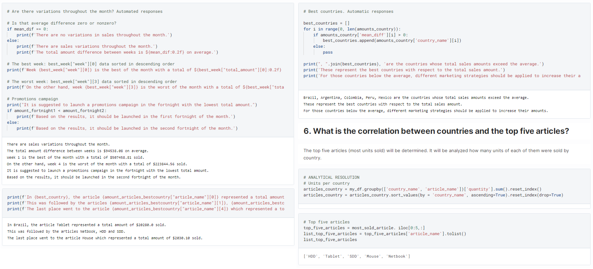 

## Data viz

I used Matplotlib and Seaborn libraries for data visualization. Plot settings were established at the begining. All plots retain same color palettes. In the graphic resolution I highlighted the correct answer to make it easily visible. Barplots were plotted horizontally to ease label reading, except the ones that show increased or decreased numbers.

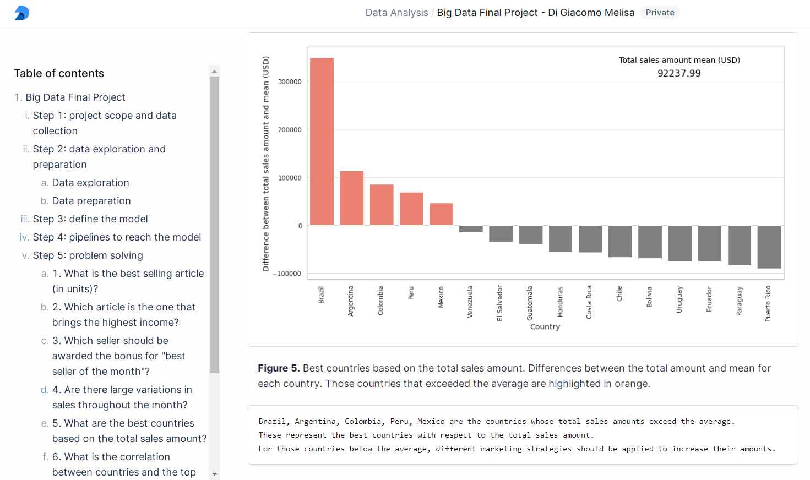 

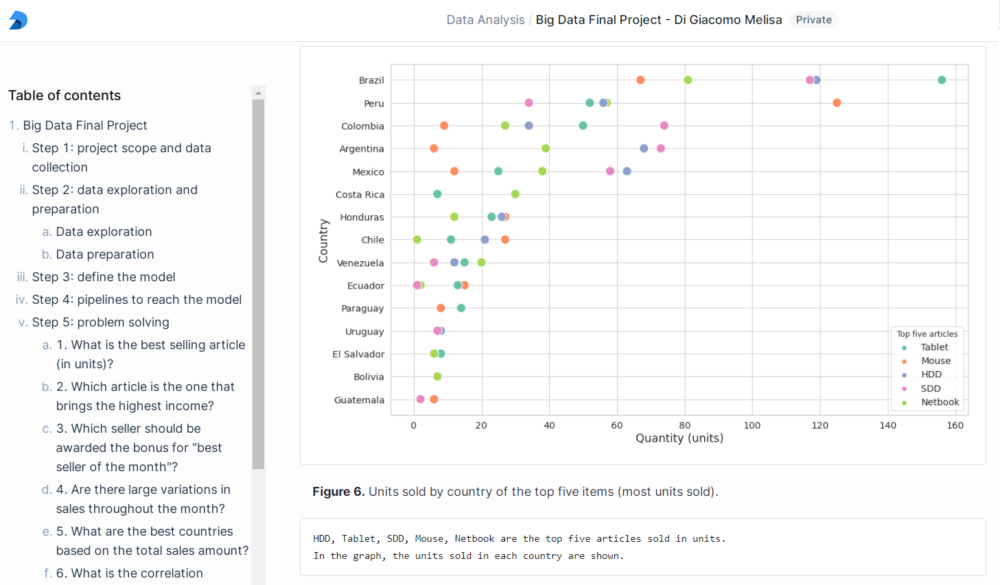 

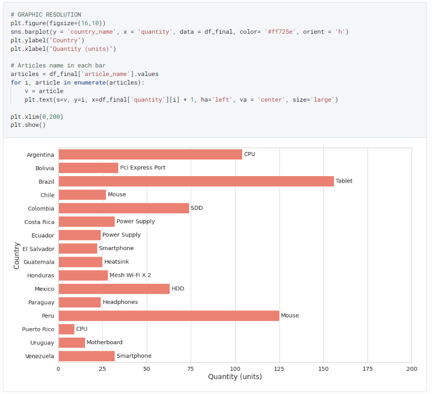 

# [SQL data analysis project](SQL_queries/sql_bigdata.sql) 

In this new part of the project I integrated the three datasets from the [Python Data Analysis Report](#python) (articles, sellers and orders).  
I used SQL queries to answer some of the questions I have already solved in Python.

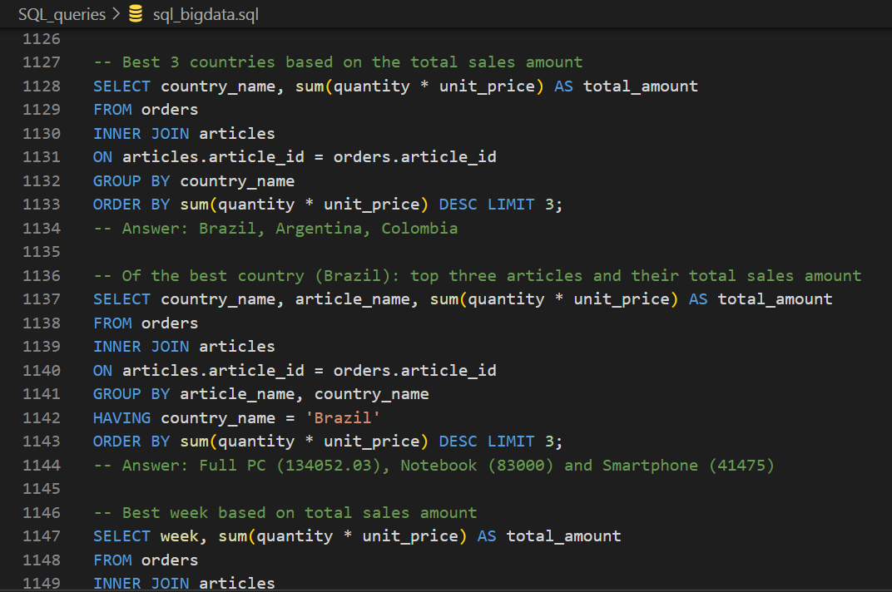